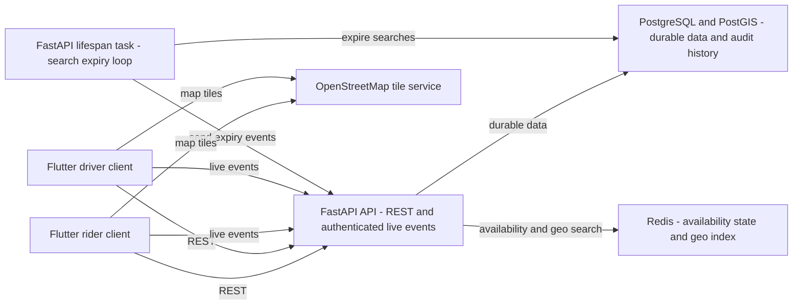
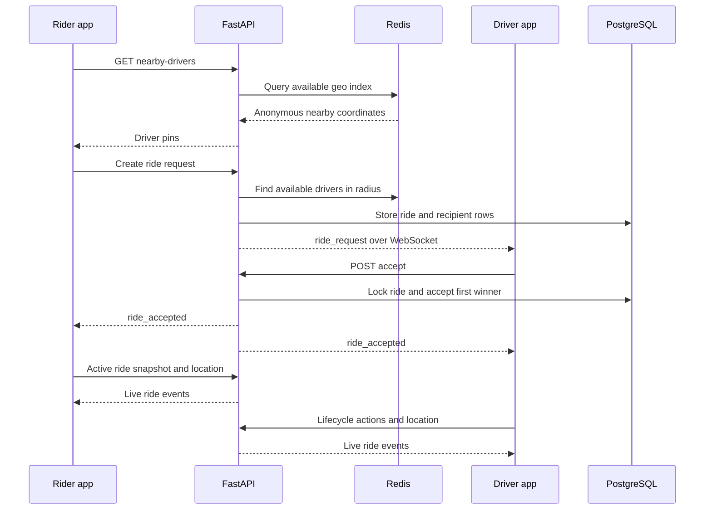

# E-Rick Connect

E-Rick Connect is a Flutter rider/driver application backed by a FastAPI ride service. The current MVP covers local authentication, driver availability, nearby-driver discovery, ride-request matching, ride lifecycle actions, and live participant tracking.

Payments, fare calculation, ratings, promotions, push notifications, and profile-image storage are not implemented in the current service boundary.

## Repository map

| Area | Location | Documentation |
| --- | --- | --- |
| Backend API, database models, migrations, and live events | [`backend/`](backend/) | [`backend/README.md`](backend/README.md) |
| Flutter mobile/web client | [`erick_connect_app/`](erick_connect_app/) | [`erick_connect_app/README.md`](erick_connect_app/README.md) |
| Generated/build output | `build/` and platform build folders | Do not edit by hand |

## System design



The server is the source of truth for authentication, ride state, and active-ride snapshots. Redis is used for fast driver availability and proximity lookup; accepted-ride state and the latest participant locations are persisted in PostgreSQL. WebSocket connections are authenticated with the same JWT access token used by REST.

## Main user flows

### Ride request and matching



Ride requests start as `searching`. The configured search timeout expires unanswered requests; the first eligible driver to accept wins, other recipients are closed, and the winning driver becomes busy.

## Local development

### Prerequisites

- Python 3.11+ with a virtual environment.
- Flutter/Dart compatible with the SDK constraint in `erick_connect_app/pubspec.yaml` (`^3.9.2`).
- PostgreSQL with the PostGIS extension, or a Supabase PostgreSQL database with PostGIS enabled.
- Redis for driver availability and nearby-driver discovery.

Start the backend first:

```powershell
cd backend
python -m venv .venv
.\.venv\Scripts\Activate.ps1
pip install -r requirements.txt
Copy-Item .env.example .env
# Set SUPABASE_DB_URL or DATABASE_URL, JWT_SECRET_KEY, and REDIS_URL in .env
alembic upgrade head
uvicorn app.main:app --reload
```

Then start Flutter from a second terminal:

```powershell
cd erick_connect_app
flutter pub get
flutter run
```

The backend exposes interactive API documentation at [`http://localhost:8000/docs`](http://localhost:8000/docs) and ReDoc at [`http://localhost:8000/redoc`](http://localhost:8000/redoc).

For an Android emulator, the client normally needs `BASE_URL=http://10.0.2.2:8000`; a physical device needs the development machine’s LAN address. Use an HTTPS base URL outside local development so the client derives `wss://` for live events.

## Engineering conventions

- Keep REST endpoint paths in `erick_connect_app/lib/config/api_endpoints.dart`.
- Keep ride transitions in the backend state machine; callers must not mutate ride status directly.
- Treat `ride_snapshot` and REST snapshots as recovery data after reconnects or app resume.
- Do not expose rider identity or contact details in nearby-driver discovery or unaccepted ride-request events.
- Do not commit `.env` files, JWT secrets, database credentials, or production URLs.

## Further reading

- Backend architecture, API surface, persistence, WebSocket protocol, and operations: [`backend/README.md`](backend/README.md)
- Flutter architecture, screens, services, WebSocket manager, location handling, and client configuration: [`erick_connect_app/README.md`](erick_connect_app/README.md)
