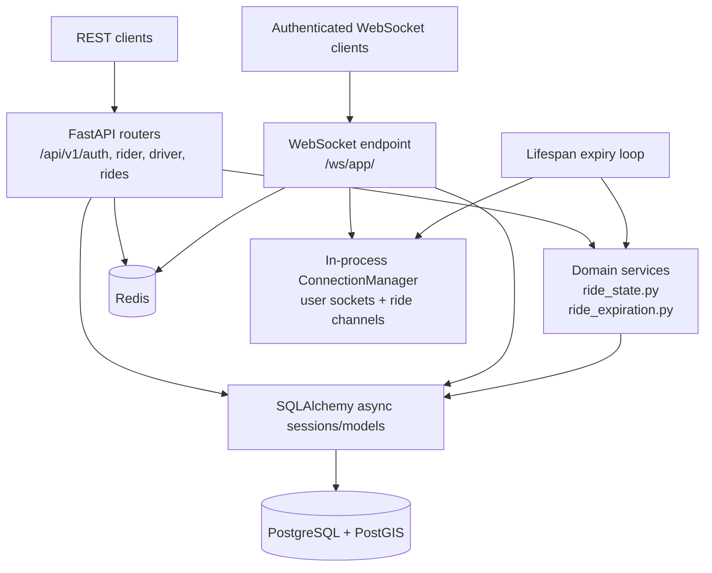
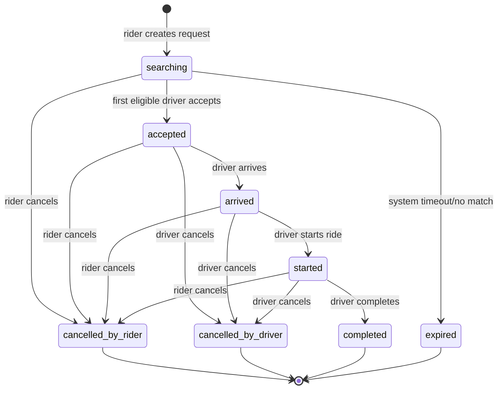

# E-Rick Connect backend

The backend is an asynchronous FastAPI service for authentication, driver availability, ride-request matching, ride lifecycle management, and live location/events. It is intentionally scoped to the account and ride-connection MVP; it does not implement payments, fares, ratings, promotions, push delivery, or profile-image storage.

## Architecture



### Runtime responsibilities

- **PostgreSQL/PostGIS** stores users, roles, sessions, devices, driver profiles, rides, request recipients, append-only ride status history, and the latest location for each active-ride participant.
- **Redis** stores the available-driver geospatial index and per-driver availability/location state. Driver location updates are rate-limited by `DRIVER_LOCATION_MIN_INTERVAL_SECONDS`.
- **FastAPI** serves versioned REST endpoints and `/ws/app/` for authenticated live events.
- **ConnectionManager** keeps connected sockets by user ID and routes ride events to the participants of an accepted ride. This registry is process-local; run the current implementation as a single application worker unless a shared WebSocket/pub-sub layer is added.
- **Lifespan expiry task** checks overdue `searching` rides periodically and sends expiry/closure events to connected clients.

## Project layout

```text
backend/
├── app/
│   ├── api/
│   │   ├── router.py              # versioned REST router
│   │   └── v1/
│   │       ├── auth.py             # register, login, refresh, profile, logout
│   │       ├── driver.py           # availability and request responses
│   │       ├── health.py           # health endpoint
│   │       ├── ride.py             # lifecycle, snapshots, history
│   │       ├── rider.py            # nearby drivers and ride requests
│   │       └── websocket.py        # auth, live events, location updates
│   ├── core/
│   │   ├── config.py               # Pydantic settings and required secrets
│   │   ├── geo.py                  # geographic point helpers
│   │   ├── redis.py                # Redis client/key helpers
│   │   └── security.py             # password/JWT/refresh-token helpers
│   ├── db/
│   │   ├── models/                 # SQLAlchemy identity, driver, ride models
│   │   └── session.py              # async database sessions
│   ├── services/
│   │   ├── ride_state.py            # validated lifecycle transitions + audit rows
│   │   └── ride_expiration.py       # atomic expiry of overdue searches
│   └── main.py                     # app factory, CORS, lifespan task
├── alembic/                        # schema migrations
├── .env.example                    # local configuration template
├── alembic.ini
└── requirements.txt
```

## Ride lifecycle



Every transition increments `state_version` and writes a `ride_status_history` row. The ride and relevant recipient rows are locked during acceptance/transition handling so two drivers cannot accept the same request successfully.

## Configuration

Create `backend/.env` from `.env.example`:

| Variable | Purpose | Default/constraint |
| --- | --- | --- |
| `SUPABASE_DB_URL` | Preferred PostgreSQL connection URL | Takes precedence over `DATABASE_URL` |
| `DATABASE_URL` | Local PostgreSQL fallback | PostgreSQL scheme required |
| `DATABASE_SSLMODE` | Supabase pooler SSL override | SSL is required unless set to `disable` |
| `JWT_SECRET_KEY` | Signs access tokens | Required; at least 32 characters |
| `ACCESS_TOKEN_EXPIRE_MINUTES` | Access-token lifetime | `15` |
| `REFRESH_TOKEN_EXPIRE_DAYS` | Refresh-session lifetime | `30` |
| `REDIS_URL` | Redis availability/geo index | Required; `redis://` or `rediss://` |
| `DRIVER_LOCATION_MIN_INTERVAL_SECONDS` | Driver location write throttle | `3` |
| `RIDE_REQUEST_BROADCAST_RADIUS_METERS` | Matching radius | `1000`, allowed `100–10000` |
| `RIDE_REQUEST_SEARCH_TIMEOUT_SECONDS` | Search timeout | `60`, allowed `10–600` |
| `RIDE_REQUEST_EXPIRY_CHECK_INTERVAL_SECONDS` | Expiry polling interval | `5`, allowed `1–60` |

`CORS_ORIGINS` is configured by the `Settings` class rather than the example file. Update `app/core/config.py` for a deployed frontend origin.

## Setup and operations

```powershell
cd backend
python -m venv .venv
.\.venv\Scripts\Activate.ps1
pip install -r requirements.txt
Copy-Item .env.example .env
# Edit .env before running migrations
alembic upgrade head
uvicorn app.main:app --reload
```

Useful commands:

```powershell
# Show migration state
alembic current

# Show migration history
alembic history

# Start without auto-reload
uvicorn app.main:app
```

The initial migration enables PostGIS, so the target database must permit the `postgis` extension. Migrations are loaded from `app.db.models` through `alembic/env.py`.

## REST API

All REST paths below are prefixed with `/api/v1`. Protected routes require `Authorization: Bearer <access-token>`.

| Area | Endpoint | Purpose |
| --- | --- | --- |
| Health | `GET /health` | Health check |
| Auth | `POST /auth/register` | Create rider/driver account and session |
| Auth | `POST /auth/login` | Login with phone or email |
| Auth | `POST /auth/refresh` | Rotate refresh token and issue access token |
| Auth | `GET /auth/me` | Return authenticated account |
| Auth | `GET /auth/profile` | Return account and driver availability fields |
| Auth | `POST /auth/logout` | Revoke current refresh session |
| Rider | `GET /rider/nearby-drivers` | Anonymous nearby available-driver coordinates |
| Rider | `POST /rider/request` | Create a searching ride and match nearby drivers |
| Driver | `POST /driver/online` | Mark driver available and add location to Redis |
| Driver | `POST /driver/offline` | Remove driver from availability index |
| Driver | `GET /driver/status` | Read driver availability |
| Driver | `GET /driver/ride-requests/pending` | Recover durable pending requests |
| Driver | `POST /driver/ride-requests/{ride_id}/accept` | Accept a request atomically |
| Driver | `POST /driver/ride-requests/{ride_id}/decline` | Decline a recipient row |
| Ride | `GET /rides/history` | List authenticated user’s rides |
| Ride | `GET /rides/active` | Read the current active ride |
| Ride | `POST /rides/{ride_id}/arrive` | Driver marks arrival |
| Ride | `POST /rides/{ride_id}/start` | Driver starts the ride |
| Ride | `POST /rides/{ride_id}/complete` | Driver completes the ride |
| Ride | `POST /rides/{ride_id}/driver-cancel` | Driver cancels with a reason |
| Ride | `POST /rides/{ride_id}/rider-cancel` | Rider cancels with a reason |
| Ride | `GET /rides/{ride_id}/snapshot` | Current status/version and peer location |
| Ride | `GET /rides/{ride_id}/history` | Audited state transition history |

## WebSocket protocol

Connect to `ws(s)://<host>/ws/app/?token=<access-token>`. The server rejects missing, invalid, expired, or revoked sessions before accepting the connection. Use `wss://` outside local development.

On connection, the server sends `connection.ready` and may send a current `ride_snapshot` for an active ride. Incoming client messages are JSON objects with one of these types:

| Client message | Sender | Effect |
| --- | --- | --- |
| `driver_location_update` | Driver | Updates availability location; if an active ride is supplied, stores and forwards the driver’s latest ride location |
| `rider_location_update` | Rider | Stores and forwards the rider’s latest active-ride location |
| `ping` | Either | Server responds with `pong` |

Important server-to-client events:

| Event | Recipients | Purpose |
| --- | --- | --- |
| `connection.ready` | Connected user | Handshake completed |
| `ride_snapshot` | Active ride participants | Initial/resync state and peer location |
| `ride_request` | Matched connected drivers | New nearby request |
| `ride_accepted` | Rider and winning driver | Assignment and `ride:{ride_id}` channel name |
| `ride_request_closed` | Other recipients | Request cancelled, expired, or accepted elsewhere |
| `ride_request_expired` | Rider | Search timed out |
| `ride_state_changed` | Ride participants | Lifecycle transition and state version |
| `ride_location_updated` | Peer participant | New location with monotonic sequence |
| `location_updated` | Sending participant | Location write accepted |

The recipient list in PostgreSQL makes request recovery possible even when a driver was disconnected. A connected driver receives the WebSocket event; after reconnecting, the Flutter client calls the pending-request REST endpoint.

## Security and privacy boundaries

- Passwords are hashed; raw refresh tokens are not stored, only their hashes.
- Access tokens contain the user/session identity and roles; WebSocket authentication also validates the backing session and revocation state.
- Nearby-driver responses expose only driver ID and coordinates. Unaccepted request events do not expose rider identity/contact details.
- Ride locations are stored only as the latest rider and driver point per active ride; continuous location history is not retained.
- Cancellation requires a non-empty reason at the state-machine boundary.
- Keep secrets out of source control and use TLS for deployed REST/WebSocket traffic.
