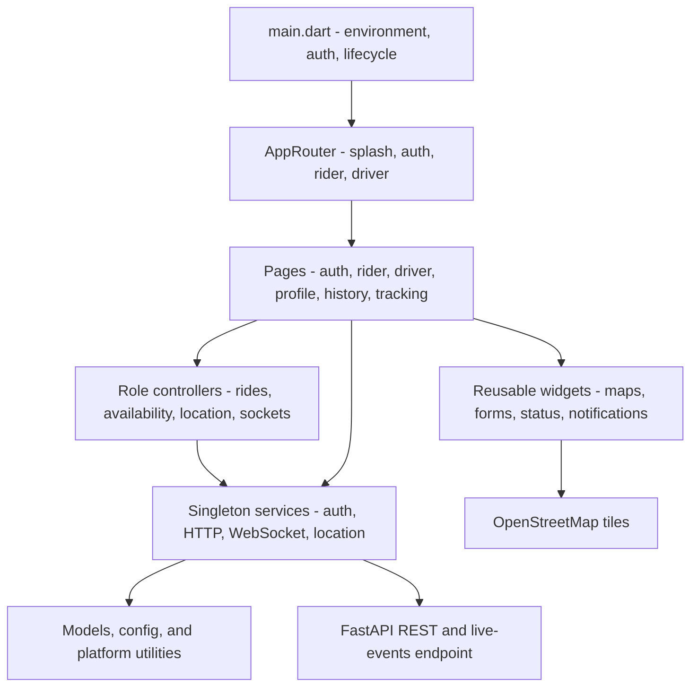
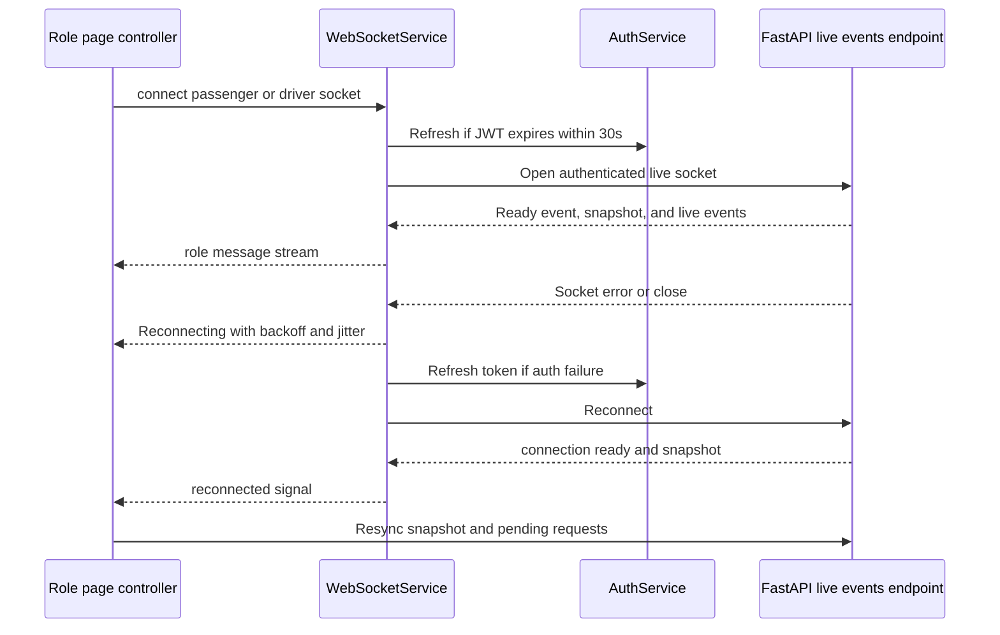

# E-Rick Connect Flutter client

This directory contains the Flutter rider and driver application. It supports Android, iOS, web, and the other Flutter targets generated by the project. The client talks to the FastAPI backend over authenticated REST and one shared live-events endpoint, `/ws/app/`.

## Client architecture



The UI is page-scoped, while network/auth/location services are centralized. The backend remains the source of truth: the client restores active rides from `/rides/active`, restores driver requests from `/driver/ride-requests/pending`, and resynchronizes tracking from `/rides/{ride_id}/snapshot` after a reconnect.

## Directory structure

```text
lib/
├── config/
│   ├── api_endpoints.dart       # REST endpoint builders
│   ├── app_constants.dart       # timeouts, location, WebSocket constants
│   └── constants.dart            # BASE_URL/.env loading and fallback
├── core/
│   ├── controllers/              # role-specific orchestration
│   ├── mixins/                   # safe widget state updates
│   ├── theme/                    # light/dark Material theme
│   └── widgets/                  # reusable map, form, status, request UI
├── models/                       # profile and strongly-typed ride ID helpers
├── pages/
│   ├── auth/                     # login and signup
│   ├── driver/                   # availability, requests, driver tracking
│   ├── profile/                  # account/profile view
│   └── user/                     # rider map, request loading, tracking, history
├── router/                       # initial-route/auth-aware navigation
├── services/                     # HTTP, auth, WebSocket, location, errors, logs
└── utils/                        # platform WebSocket creation and URI helpers
```

## What the frontend handles

### App startup and navigation

`main.dart` initializes Flutter, loads environment configuration with a short timeout, initializes `AuthService`, determines the initial route, and observes app lifecycle changes. When the app returns to the foreground, it asks `WebSocketService` to validate and recover active sockets.

`AppRouter` routes unauthenticated users through splash/login/signup and authenticated users to the rider or driver home screen based on the stored role. Tracking, profile, and previous-ride pages are pushed from the role-specific pages.

### Authentication and session storage

`AuthService` stores access and refresh tokens plus user data in `SharedPreferences`. It handles:

- register/login response persistence;
- access-token refresh with refresh-token rotation;
- concurrent refresh de-duplication;
- auth-state checks for route guards;
- logout cleanup and WebSocket disconnection;
- reconnecting active sockets after a successful token refresh.

`ApiService` attaches the access token to protected requests, applies the shared 30-second request timeout, logs network activity, and retries a `401` once after refreshing the access token. `ErrorService` maps network and HTTP failures to user-facing messages.

### Central WebSocket manager

`services/websocket_service.dart` is a singleton connection manager for live ride events. It intentionally keeps passenger and driver channels separate even though both use `/ws/app/`.



The manager provides:

- separate passenger and driver message streams;
- connection states: `disconnected`, `connecting`, `connected`, `reconnecting`, `failed`;
- a 10-second handshake timeout and native 20-second ping interval;
- up to five reconnect attempts with exponential backoff, jitter, and a 60-second cap;
- a recovery probe after the retry limit;
- app-resume recovery because mobile operating systems may suspend sockets;
- access-token refresh before expiry and replacement of the live channel;
- detection of authentication failures and token-redacted error logging;
- reconnect signals used by pages to reload snapshots or pending requests.

`UserWebSocketController` and `DriverWebSocketController` adapt the shared streams to role-specific UI. The rider controller de-duplicates ride events; the driver controller turns `ride_request` into an offer and removes requests on `ride_request_closed`.

### Rider experience

`UserMapScreen`:

- requests location permission and reads the current location;
- loads anonymous nearby-driver pins from `GET /api/v1/rider/nearby-drivers`;
- submits pickup/drop-off and passenger count to `POST /api/v1/rider/request`;
- shows a loading state while the request is searching;
- handles `ride_accepted`, `ride_request_expired`, and no-driver events;
- restores an active ride after an app restart using the backend active-ride endpoint;
- provides profile and previous-rides navigation.

`UserTrackingPage`:

- connects to the passenger WebSocket;
- loads a REST snapshot before relying on live events;
- applies only newer `state_version` and participant-location sequence values;
- renders rider/driver markers on the map;
- publishes the rider’s active-ride location only while the page is alive;
- resyncs the snapshot and republishes the latest location after reconnect;
- lets the rider cancel an active ride and handles terminal states.

### Driver experience

`DriverPage`:

- requests the driver’s location;
- toggles online/offline availability through the driver REST endpoints;
- starts/stops location updates with the driver availability state;
- connects the driver WebSocket;
- restores pending requests from `GET /api/v1/driver/ride-requests/pending`;
- displays live `ride_request` notifications;
- accepts or declines requests through REST;
- opens driver tracking after acceptance.

`DriverTrackingPage`:

- displays pickup, rider, and driver locations;
- publishes the driver’s active-ride location;
- applies live state/location events with sequence/version checks;
- executes the driver lifecycle actions: arrive, start, complete, and cancel;
- disposes location publishing when the ride becomes terminal or the page closes.

### Location and maps

`LocationService` centralizes permission checks, service-enabled checks, current-position reads, continuous position streams, distance, and bearing calculations. `DriverLocationController` sends availability updates over the driver socket. `RideLocationPublisher` is page-scoped and sends only the signed-in participant’s location for the current ride.

`flutter_map` renders OpenStreetMap tiles. `UserMapWidget`, `DriverMapWidget`, and the tracking pages own marker presentation; the backend owns matching and persisted tracking state.

### Cross-platform WebSocket support

`utils/socket_channel_factory.dart` selects the platform implementation:

- native IO uses `IOWebSocketChannel` and supports the configured ping interval;
- web uses `HtmlWebSocketChannel`; browser code does not expose protocol ping frames, so it relies on server/browser WebSocket behavior;
- `ws_utils.dart` derives `ws://` or `wss://` from `BASE_URL` and appends the token query parameter.

## Client configuration

The client reads `BASE_URL` from `.env` on mobile/desktop. The `.env` file is deliberately not included as an asset and must not be committed. Flutter web skips `.env` loading and falls back to the value in `lib/config/constants.dart`, currently `http://localhost:8000`; set the deployed/web base URL in the client configuration before shipping.

Examples:

```text
# erick_connect_app/.env for a local Android emulator
BASE_URL=http://10.0.2.2:8000
```

Use the backend host’s LAN address for a physical device. With an HTTPS base URL, `ws_utils.dart` automatically uses `wss://` for the live channel.

## Run and build

```powershell
cd erick_connect_app
flutter pub get
flutter analyze
flutter test
flutter run
```

Common build commands:

```powershell
flutter build apk
flutter build ios
flutter build web
```

The project declares Android/iOS launcher-icon configuration and bundled image assets in `pubspec.yaml`.

## Platform requirements

- Android declares fine and coarse location permissions in `android/app/src/main/AndroidManifest.xml`.
- iOS location usage text and signing/capabilities must be configured in the native Xcode project before distribution.
- Map tiles require network access. Follow the OpenStreetMap tile usage policy for production traffic.
- Web browsers require a backend CORS origin that matches the deployed client URL.

## Client/backend contract

REST paths are centralized in `lib/config/api_endpoints.dart`:

| Client area | Backend contract |
| --- | --- |
| Auth | `/api/v1/auth/*` |
| Rider discovery/request | `/api/v1/rider/nearby-drivers`, `/api/v1/rider/request` |
| Driver availability | `/api/v1/driver/online`, `/offline`, `/status` |
| Driver requests | `/api/v1/driver/ride-requests/pending`, `/{ride_id}/accept`, `/{ride_id}/decline` |
| Ride lifecycle | `/api/v1/rides/{ride_id}/arrive`, `/start`, `/complete`, `/driver-cancel`, `/rider-cancel` |
| Ride recovery/history | `/active`, `/{ride_id}/snapshot`, `/{ride_id}/history`, `/history` |
| Live events | `ws(s)://<host>/ws/app/?token=<access-token>` |

The most important live events are `connection.ready`, `ride_request`, `ride_accepted`, `ride_request_closed`, `ride_request_expired`, `ride_snapshot`, `ride_state_changed`, `ride_location_updated`, and `location_updated`. Keep event parsing tolerant of additional fields and use snapshot/version recovery after any reconnect.

## Troubleshooting

- **Connection refused:** confirm FastAPI is running and `BASE_URL` points to the correct host for the target platform.
- **WebSocket connects then closes:** confirm the JWT is valid, the backend session has not been revoked, and the base URL uses `wss://` when TLS is enabled.
- **No nearby drivers:** confirm Redis is running, the driver is online, location permission is granted, and the driver socket is connected.
- **Stale tracking screen:** wait for automatic reconnect, then use the page’s snapshot resync path; the client intentionally does not treat in-memory state as authoritative.
- **Location unavailable:** enable the device location service and grant the app’s location permission.
